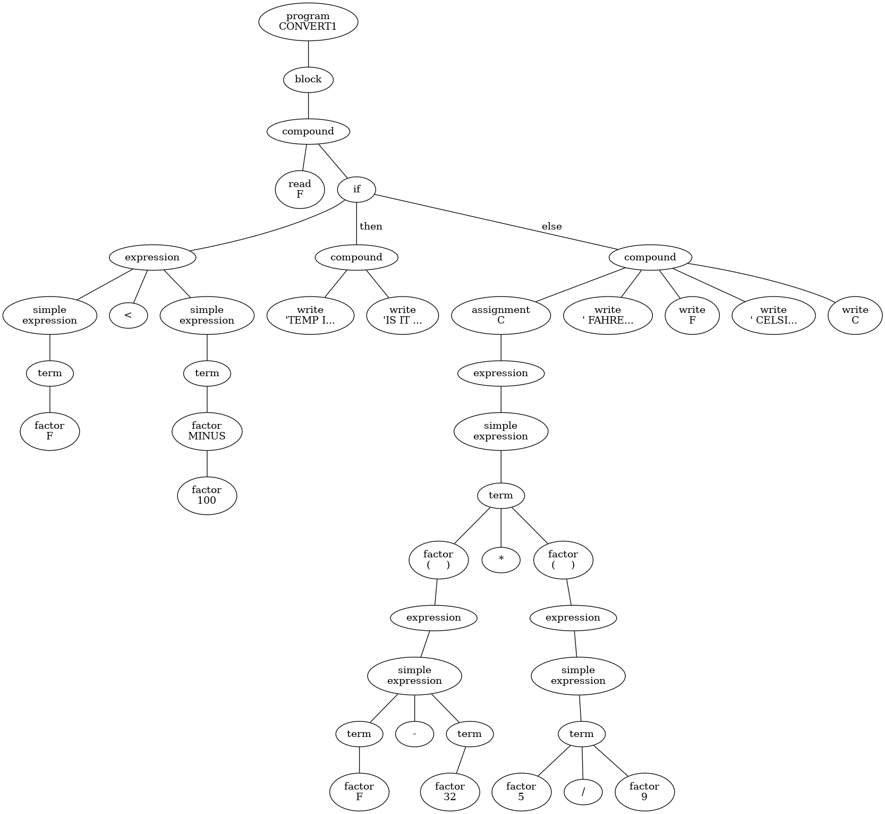
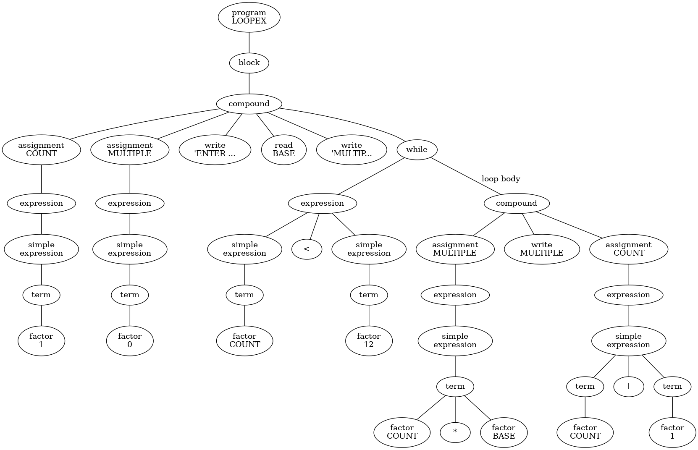

# TIPS Interpreter using C++

This projcet implements a recursive-descent parser for a simplified Pascal-like programming language called TIPS (Ten Instruction Pascal Subset). The parser reads a `.pas` program, checks it for syntax correctness, builds a parse tree, executes the code, and prints the resulting structure.
This project is done in 2021

## Overview
The program performs the following steps:
1. **Lexical Analysis**
   - A lexer (generated with Flex) reads the input program and converts it into tokens.
   - Token types include keywords, identifiers, operators, literals, and punctuation.
2. **Parsing**
   - A recursive-descent parser processes the token stream using grammar production rules.
   - Each production rule constructs nodes in a parse tree.
3. **Symbol Table Management**
   - Variables declared in the program are stored in a symbol table.
   - The parser verifies that identifiers are declared before they are used.
4. **Parse Tree Construction**
   - The parser builds a hierarchical parse tree representing the structure of the program.
5. **Output**
   - If parsing succeeds:
     - The symbol table is printed
     - The parse tree is printed using an in-order traversal

---

## Language Features Supported
The parser supports core TIPS language constructs, including:
- Variable declarations
- Assignments
- Arithmetic expressions
- IF / THEN / ELSE statements
- WHILE loops
- READ statements
- WRITE statements
- Compound states (`BEGIN ... END`)

Example grammar components implemented include:
- Program
- Block
- Compound statement
- Assignment
- Expression
- Term
- Factor

---

## Example Parse Tree
The following diagrams visualize how a TIPS program is broken into components by the parser.

### IF Example


### WHILE Example


These diagrams illustrate the hierarchical structure of the parsed program and how expressions and statements are decomposed into nodes.

---

## Project Structure
- driver.cpp
- lexer.h
- parse_tree_nodes.h
- production.h
- rules.l
- makefile
- Test files/
    - error.correct
    - error.pas
    - error2.correct
    - error2.pas
    - if_sample.correct
    - if_sample.pas
    - if_sample.png
    - sample.correct
    - sample.pas
    - sample.png
    - test.pas
    - while_sample.correct
    - while_sample.pas
    - while_sample.png

### Key Files
**driver.cpp**
- Reads the input `.pas` file
- Initializes the lexer
- Starts parsing from the `<program>` rule
- Prints the symbol table and parse tree after successful parsing.

The parser begins by calling:
```cpp
root = program();
```
which triggers the recursive parsing of the entire program.

**lexer.h**
Defines all token types used by the parser, including:
- Keywords (PROGRAM, BEGIN, IF, WHILE, etc.)
- Operators (+, -, *, /, etc.)
- Literals and identifiers
The lexical analyzer produces these tokens.

**parse_tree_nodes.h**
Defines the classes used to represent parse tree nodes, including:
- ProgramNode
- BlockNode
- CompoundNode
- AssignmentNode
- ExpressionNode
- TermNode
- FactorNode
- IfThenNode
- WhileNode

Each node contains child nodes representing the structure of the parsed program, and includes printing functions for displaying the tree.

**production.h**
Contains the recursive-descent parser implementation.
Each grammar rule corresponds to a parsing function:
```
program()
block()
statement()
assignment()
expression()
simpleExpression()
term()
factor()
```
These functions consume tokens and construct parse tree nodes while checking syntax rules.

**rules.l**
Flex lexer specification that converts the input program into tokens.

**makefile**
Build script used to compile the parser and lexer.

## Example Input
Example TIPS program (if_sample.pas):
```
PROGRAM CONVERT1;
VAR
   F : INTEGER;
BEGIN
   READ(F);
   IF F < 100 THEN
      WRITE('TEMP IS LOW')
   ELSE
      WRITE('FAHRENHEIT');
END
```
## Example Output
After successful parsing the program prints:
```
User Defined Symbols:
F

*** In order traversal of parse tree ***
Program Name CONVERT1
```
The full expected output for each example program is provided in the .correct files.

## How to Build
Make sure you have 
- g++
- flex
- make
- 
Then run:
```
make
```

## How to Run
Run the parser with a TIPS program:

./parser if_sample.pas


